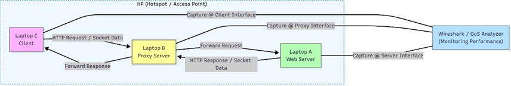

# Socket Programming

Repository ini berisi implementasi dan eksperimen **socket programming / HTTP request** menggunakan topologi **3 laptop**:
- **Laptop A** sebagai **Web Server**
- **Laptop B** sebagai **Proxy Server** + menjalankan **Wireshark**
- **Laptop C** sebagai **Client**

---

## 🧭 Topologi & Pembagian Peran Laptop

### 1) Kelompok dengan 3 Anggota (Utama)
- **Laptop A** → Web Server  
- **Laptop B** → Proxy Server + Menyalakan Wireshark  
- **Laptop C** → Client  

Berikut ilustrasi alur komunikasinya:

---

## 🔄 Alur Komunikasi Singkat
1. **Laptop C (Client)** mengirim **HTTP Request / Socket Data** ke **Laptop B (Proxy Server)**  
2. **Laptop B (Proxy Server)** melakukan **forward request** ke **Laptop A (Web Server)**  
3. **Laptop A (Web Server)** mengirim **HTTP Response / Socket Data** kembali ke **Laptop B**  
4. **Laptop B** meneruskan (**forward response**) ke **Laptop C**  
5. **Wireshark/QoS Analyzer** digunakan untuk **capture paket** pada beberapa interface:
   - Capture di sisi Client
   - Capture di sisi Proxy
   - Capture di sisi Server  

---

## 📂 Struktur Folder
- `code/` → source code (client / proxy / server)
- `img/` → gambar dokumentasi (termasuk topologi)
- `QoS/` → hasil analisis QoS (delay, throughput, packet loss, dsb)
- `static/` → file pendukung (opsional)
- `wireshark/` → file capture Wireshark (`.pcapng`) dan hasil analisis
- `received_page.html` → contoh halaman/output yang diterima client (jika digunakan)

---

## ✅ Tools yang Digunakan
- Wireshark
- Bahasa pemrograman sesuai implementasi (Python / C / Java)
- CMD / Terminal
